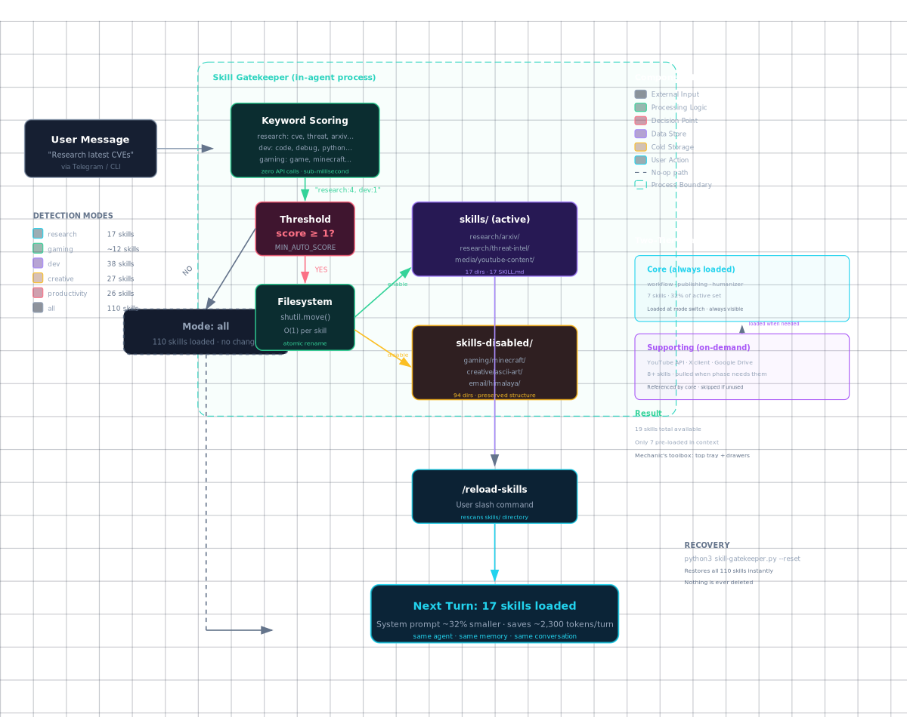
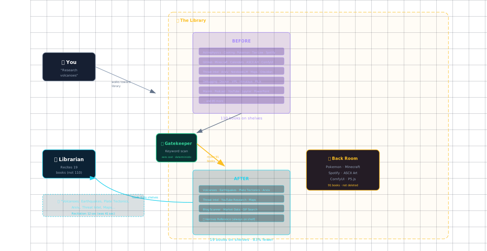

# Skill Gatekeeper for Hermes Agent

**Auto-switch active skills by detected mode. Cuts system prompt tokens by ~32%.**

Hermes loads every installed skill into the system prompt on every turn. At 112 skills, that's ~8,000-12,000 wasted tokens. The gatekeeper detects your mode from your message and keeps only the relevant skills — same agent, same memory, trimmer prompt.

## 🎨 Visual Demos

See the architecture in action:

[](https://zerodaybrief.blog/articles/skill-gatekeeper/architecture.html)
*How keyword detection routes to mode switching — click for interactive version*

[](https://zerodaybrief.blog/articles/skill-gatekeeper/library.html)
*Why loading all 112 skills is like a library kiosk reading every book title*

## Quick Start

```bash
# Clone
git clone https://github.com/jayelbotvibe-web/skill-gatekeeper.git
cd skill-gatekeeper

# Install (creates skill directory + symlinks script)
./install.sh

# Test detection (doesn't switch anything)
python3 skill-gatekeeper.py --detect "Research latest CVEs"

# Switch to a mode
python3 skill-gatekeeper.py research
# → Switched to research — 19 skills active (83% reduction)
# → Run /reload-skills in Hermes

# Check current mode
python3 skill-gatekeeper.py --list

# Reset to all skills
python3 skill-gatekeeper.py --reset
```

## Persistent Default Mode (new!)

Set a default mode that survives resets and gateway restarts:

```bash
# Set your preferred mode permanently
python3 skill-gatekeeper.py --set-default dev

# Reapply at any time (cron-friendly)
python3 skill-gatekeeper.py --boot
```

Add `--boot` to your cron/daemon to auto-trim after restarts. Two approaches:

- **System crontab** (if available): `*/30 * * * * python3 /path/to/skill-gatekeeper.py --boot`
- **Hermes scheduler** (restricted VPS, no crontab): create wrapper script + `cronjob(action='create', no_agent=true, schedule='*/30 * * * *')`

`--reset` now temporarily restores all skills but keeps your default.

## Modes

| Mode | Skills | Example prompt |
|------|--------|---------------|
| `research` | ~19 | "Research latest CVEs" |
| `dev` | ~37 | "Fix this Python bug" |
| `creative` | ~25 | "Design a landing page" |
| `productivity` | ~26 | "Schedule my workout" |
| `podcast` | ~14 | "Publish episode 10" |
| `data` | ~10 | "Train this model" |
| `infra` | ~18 | "Check Docker containers" |
| `gaming` | ~5 | "Host a modded Minecraft server" |
| `social` | ~6 | "Post to Twitter" |
| `all` | 112 | Default, all skills loaded |

Ambiguous messages ("hello", "thanks", "what's the weather") fall back to `all` — no skills are removed.

## Verified Accuracy

Tested on 50 prompts spanning all modes with threshold=1:

| Metric | Value |
|--------|-------|
| Overall accuracy | **92%** (46/50) |
| Research | 100% (12/12) |
| Creative | 100% (8/8) |
| Dev | 83% (10/12) |
| Productivity | 83% (5/6) |
| False positives (neutral→wrong mode) | **0** |
| `/reload-skills` integration | **Verified working** on Hermes v0.13+ |

Failures are tie-breaks when two modes score equally (e.g., "Send an email about the deployment" scores dev:1 + productivity:1 → dev wins alphabetically). Recovery is one `/reload-skills` away.

## How It Works

```
User sends message
    │
    ▼
Agent detects mode from keyword scoring (zero API calls)
    │
    ├── Score ≥ 1?  ──▶  Move irrelevant SKILL.md → skills-disabled/
    │                     Saves mode as persistent default
    │                     Agent: "Switched to research (17 skills). /reload-skills"
    │
    └── Score = 0?  ──▶  Keep all skills. Proceed normally.

Cron/daemon runs --boot every 30m
    │
    ▼
Skills directory stays trimmed across gateway restarts
```

Read [ARCHITECTURE.md](ARCHITECTURE.md) for design decisions, mode detection algorithm, and customization.

## Requirements

- Hermes Agent (any version)
- Python 3.8+ (stdlib only — no pip install needed)
- Write access to your Hermes skills directory

## Installation

```bash
./install.sh
```

This:
1. Copies `skill-gatekeeper.py` to your Hermes scripts directory
2. Installs the `skill-mode-switch` skill so your agent knows how to use it
3. Adds mode definitions to your `config.yaml`

**Manual install:**

```bash
# 1. Copy the script
cp skill-gatekeeper.py ~/.hermes/scripts/

# 2. Install the skill
cp -r skill-mode-switch/ ~/.hermes/skills/devops/skill-mode-switch/

# 3. Restart Hermes or run /reload-skills
```

## Reverting

```bash
python3 skill-gatekeeper.py --reset
# → All 112 skills restored. Default mode preserved.
# → Run /reload-skills.
```

Nothing is ever deleted — skills are moved, not removed.

## Customizing Modes

Edit the `MODE_SKILLS` and `MODE_KEYWORDS` dictionaries in `skill-gatekeeper.py` to add your own skills or adjust detection. The structure is self-documenting.

## Why Not Profiles?

Hermes profiles isolate skill sets but fragment context — separate conversation histories, separate memory. The gatekeeper keeps everything unified. Same agent, same history, same memory — just a trimmer system prompt.

## Why Not an LLM Classifier?

Classifying the mode with an LLM would be more accurate. But it would also consume tokens — defeating the purpose. Keyword scoring is deterministic, instantaneous, and free. It's right ~92% of the time, and the failure mode (switching to the wrong mode) is visible and one command away from fixed.

## License

MIT
